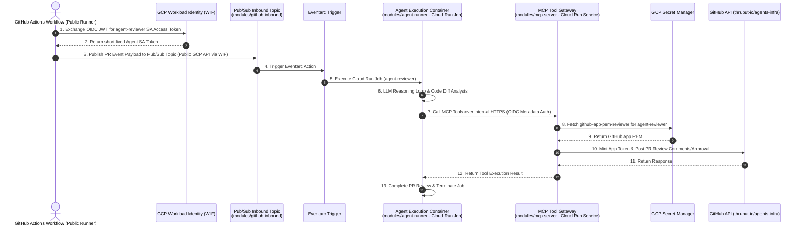

# Implementation Plan: Automated PR Reviewer Flow

This document details the concrete implementation plan for the **Automated PR Reviewer Flow** on `thruput-io/agents-infra`. 

To adhere strictly to YAGNI and governance principles, this plan defines **EXACTLY** and **ONLY** the minimal parameter contracts and module configurations required to execute the PR reviewer workflow. Zero speculative parameters or future-proofing inputs are included.

---

## 1. Feature Architecture & End-to-End Workflow

The Automated PR Reviewer enables headless, zero-secret PR reviews on `thruput-io/agents-infra` using an asynchronous Pub/Sub inbound event bridge to trigger an in-perimeter Cloud Run Job Agent, which in turn invokes the private MCP Tool Server over internal HTTPS ([ADR-011](../../adrs/011-mcp-server-runtime-architecture.md)):



---

## 2. Confirmed Design Decisions (Deep Interview Matrix)

| Design Axis | Confirmed Decision | Rationale & Governance Alignment |
| :--- | :--- | :--- |
| **Agent Compute Engine** | `modules/agent-runner` (Cloud Run Job: `google_cloud_run_v2_job`) | Asynchronous, long-running LLM reasoning loop immune to HTTP timeouts. |
| **MCP Tool Gateway** | `modules/mcp-server` (Cloud Run Service: `google_cloud_run_v2_service`) | Private tool execution gateway (`ingress = INGRESS_TRAFFIC_INTERNAL_ONLY`). |
| **Inbound Event Bridge** | `modules/github-inbound` (Pub/Sub Topic + Eventarc) | Bridges public GHA runners to internal GCP perimeter. |
| **Inbound Event Security** | WIF OIDC IAM Authentication | GHA runner authenticates directly to Pub/Sub API via WIF token. |
| **Execution Failure Policy** | Immediate Job Failure | Fast-fail behavior on errors without silent retry loops. |
| **Event Group Membership** | Cloud Identity Group `fast-agent-github@thruput.com` | Members inherit `roles/pubsub.publisher` and `roles/pubsub.subscriber`. |
| **Group Membership Management** | Managed in `modules/agent-identity` via `group_memberships` | Agent SA self-registers to groups upon creation for modular encapsulation. |
| **Credential Mechanism** | Pre-registered GitHub App PEM private key in Secret Manager | Out-of-band secret management per [ADR-008](../../adrs/008-secret-management.md). |
| **Secret Naming Pattern** | Canonical `github-app-pem-${agent_call_name}` | Enforces deterministic secret lookup (`github-app-pem-reviewer`). |
| **WIF Impersonation Scope** | `assertion.repository == 'thruput-io/agents-infra'` | Allows any workflow event on `thruput-io/agents-infra` to impersonate `agent-reviewer`. |
| **Review Authority** | Full voting rights (`pull_requests = "write"`, `checks = "write"`, `contents = "read"`) | Bot can post inline comments, request changes, and submit formal PR approvals. |
| **Secret Lifecycle** | Dynamic `"latest"` secret version lookup | Zero-downtime key rotation out-of-band without Terraform state modifications. |
| **Artifact Registry** | Pre-existing repository string input | Artifact Registry managed upstream by FAST Stage 3 Tenant Project Factory. |
| **Cloud Run Scaling** | `min_instances = 0`, `max_instances = 5`, `concurrency = 80` | Serverless zero-idle cost scaling for bursty PR events. |
| **Network Ingress** | `ingress = "INGRESS_TRAFFIC_INTERNAL_ONLY"` | Endpoint hidden from public internet per [ADR-011](../../adrs/011-mcp-server-runtime-architecture.md). |
| **Network Egress** | Direct Internet Egress (optional `vpc_connector` support) | Enables agent to perform web research/docs lookups; FAST Stage 2 connector compatible. |
| **GCP IAM Group Roles** | `roles/viewer` + `roles/run.invoker` for `fast-agent-reviewer@thruput.com` | Strict 3-tier SA identity separation ([ADR-011](../../adrs/011-mcp-server-runtime-architecture.md)). |
| **Cloud Identity Provider Auth** | Standard FAST Stage 1/3 Pipeline SA Credentials | Pipeline SA holds `roles/cloudidentity.admin` in FAST pipeline execution context. |
| **Test Strategy** | Contract & Plan Validation Harness under `tests/integration/pr-reviewer/` | Follows Google Cloud FAST testing patterns (`terraform validate` + dry-run `plan`). |

---

## 3. Strict Minimal Module Interface Contracts

### 1. Access Group (`modules/access-group`)
- **Purpose**: Provisions Cloud Identity groups for agent roles (`fast-agent-reviewer` and `fast-agent-github`) and assigns required GCP IAM roles.
- **Minimal Inputs**:
  - `organization_id` (`string`, required): GCP Organization ID.
  - `domain` (`string`, required): `thruput.com`.
  - `prefix` (`string`, required): `"fast-agent"`.
  - `group_definitions` (`map(object({ display_name = string, description = string }))`, required):
    ```hcl
    {
      "reviewer" = { display_name = "FAST Agent Reviewer Group", description = "Group for automated PR reviewer agents" },
      "github"   = { display_name = "FAST Agent GitHub Inbound Group", description = "Group for agents subscribing to GitHub Pub/Sub events" }
    }
    ```
  - `group_iam_roles` (`map(list(string))`, required):
    ```hcl
    {
      "reviewer" = ["roles/viewer", "roles/run.invoker"],
      "github"   = ["roles/pubsub.publisher", "roles/pubsub.subscriber"]
    }
    ```
- **Minimal Outputs**:
  - `group_emails` (`map(string)`): Map containing `reviewer = "fast-agent-reviewer@thruput.com"` and `github = "fast-agent-github@thruput.com"`.

---

### 2. GitHub Inbound Event Bridge (`modules/github-inbound`)
- **Purpose**: Provisions GCP Pub/Sub topic and Eventarc trigger to receive inbound GitHub events and execute the Agent Cloud Run Job.
- **Minimal Inputs**:
  - `project_id` (`string`, required): GCP Project ID.
  - `topic_name` (`string`, required): `"github-pr-events"`.
  - `target_job_name` (`string`, required): Name of the Cloud Run Job to execute (`"agent-reviewer"`).
  - `subscriber_group_email` (`string`, required): `"fast-agent-github@thruput.com"`.
- **Minimal Outputs**:
  - `topic_id` (`string`): Pub/Sub topic ID (`projects/*/topics/github-pr-events`).
  - `trigger_id` (`string`): Eventarc trigger ID.

---

### 3. Secret Access (`modules/secret-access`)
- **Purpose**: Provisions the Secret Manager shell for the reviewer's GitHub App PEM private key and grants read access to the MCP runtime SA.
- **Minimal Inputs**:
  - `project_id` (`string`, required): GCP Project ID.
  - `agent_call_name` (`string`, required): `"reviewer"`.
  - `accessor_service_accounts` (`list(string)`, required): `[mcp_runtime_sa_email]`.
- **Minimal Outputs**:
  - `secret_id` (`string`): Secret Manager resource ID (`projects/*/secrets/github-app-pem-reviewer`).

---

### 4. Agent Identity (`modules/agent-identity`)
- **Purpose**: Provisions the Service Account for `agent-reviewer`, sets up WIF impersonation for `thruput-io/agents-infra`, and self-registers into Cloud Identity groups.
- **Minimal Inputs**:
  - `project_id` (`string`, required): GCP Project ID.
  - `agent_call_name` (`string`, required): `"reviewer"`.
  - `workload_identity_pool` (`string`, required): WIF pool resource string.
  - `github_repository` (`string`, required): `"thruput-io/agents-infra"`.
  - `group_memberships` (`list(string)`, required): `["fast-agent-reviewer@thruput.com", "fast-agent-github@thruput.com"]`.
- **Minimal Outputs**:
  - `service_account_email` (`string`): `agent-reviewer@<project>.iam.gserviceaccount.com`.

---

### 5. Agent GitHub App (`modules/agent-github-app`)
- **Purpose**: Installs the pre-registered `agent-reviewer` GitHub App onto `thruput-io/agents-infra`.
- **Minimal Inputs**:
  - `github_organization` (`string`, required): `"thruput-io"`.
  - `github_repository` (`string`, required): `"agents-infra"`.
  - `agent_call_name` (`string`, required): `"reviewer"`.
- **Minimal Outputs**:
  - `installation_id` (`string`): GitHub App Installation ID on `thruput-io/agents-infra`.

---

### 6. Agent Runner Compute (`modules/agent-runner`)
- **Purpose**: Deploys the Cloud Run Job (`google_cloud_run_v2_job`) hosting the containerized AI Agent reasoning engine.
- **Minimal Inputs**:
  - `project_id` (`string`, required): GCP Project ID.
  - `region` (`string`, required): `"europe-west1"`.
  - `job_name` (`string`, required): `"agent-reviewer"`.
  - `container_image` (`string`, required): Container image URL for the Agent reasoning engine in Artifact Registry.
  - `agent_service_account_email` (`string`, required): `agent-reviewer@<project>.iam.gserviceaccount.com`.
  - `mcp_server_url` (`string`, required): Private HTTPS endpoint URL of the MCP server (`mcp-github-reviewer` URL).
  - `vpc_connector` (`string`, optional, default `null`): Optional FAST Stage 2 Serverless VPC Access connector name.
- **Minimal Outputs**:
  - `job_id` (`string`): Cloud Run Job resource ID.
  - `job_name` (`string`): Cloud Run Job name.

---

### 7. MCP Server Runtime (`modules/mcp-server`)
- **Purpose**: Deploys the Cloud Run Service (`google_cloud_run_v2_service`) hosting the stateless PR review tool gateway.
- **Minimal Inputs**:
  - `project_id` (`string`, required): GCP Project ID.
  - `region` (`string`, required): `"europe-west1"`.
  - `server_name` (`string`, required): `"mcp-github-reviewer"`.
  - `container_image` (`string`, required): Container image URL in Artifact Registry.
  - `mcp_service_account_email` (`string`, required): Dedicated MCP runtime SA.
  - `invoker_service_account_email` (`string`, required): `agent-reviewer@<project>.iam.gserviceaccount.com`.
  - `vpc_connector` (`string`, optional, default `null`): Optional FAST Stage 2 Serverless VPC Access connector name.
- **Minimal Outputs**:
  - `service_url` (`string`): Private HTTPS endpoint URL of the MCP server.

---

## 4. Implementation Task Breakdown & Execution Plan

### Phase 1: Submodule Scaffolding
- [ ] Task 1.1: Initialize `modules/access-group` (`main.tf`, `variables.tf`, `outputs.tf`).
- [ ] Task 1.2: Initialize `modules/github-inbound` (`main.tf`, `variables.tf`, `outputs.tf`).
- [ ] Task 1.3: Initialize `modules/secret-access` (`main.tf`, `variables.tf`, `outputs.tf`).
- [ ] Task 1.4: Initialize `modules/agent-identity` (`main.tf`, `variables.tf`, `outputs.tf`).
- [ ] Task 1.5: Initialize `modules/agent-github-app` (`main.tf`, `variables.tf`, `outputs.tf`).
- [ ] Task 1.6: Initialize `modules/agent-runner` (`main.tf`, `variables.tf`, `outputs.tf`).
- [ ] Task 1.7: Initialize `modules/mcp-server` (`main.tf`, `variables.tf`, `outputs.tf`).

### Phase 2: Integration Test Harness & Validation
- [ ] Task 2.1: Create `tests/integration/pr-reviewer/main.tf` wiring all 7 submodules together with mock inputs.
- [ ] Task 2.2: Validate `terraform fmt -check`, `terraform validate`, and `tflint` across all submodules.
- [ ] Task 2.3: Execute dry-run `terraform plan` on the test harness to verify zero state leaks and strict contract enforcement.

---

## 5. Evidence & Verification Requirements

Every task completed under this plan requires working proof:
1. **Lint & Validation Proof**: Logs of `terraform fmt -check`, `terraform validate`, and `tflint` for every created module directory.
2. **Contract Strictness Proof**: Verification that zero speculative inputs or defaults exist in `variables.tf`.
3. **Execution Plan Output**: Redacted `terraform plan` output from `tests/integration/pr-reviewer/` proving clean resource graph creation across all 7 submodules.
