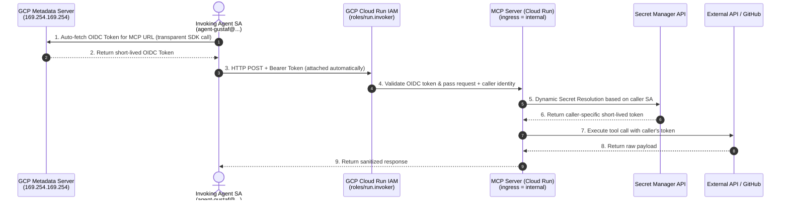

# MCP Layer Architecture & Identity Specification

This document details the runtime architecture, identity separation, network ingress rules, authentication protocols, and dynamic secret resolution strategy for the Model Context Protocol (MCP) server layer (`modules/mcp-server`) within Google Cloud FAST infrastructure.

---

## 1. Architectural Overview & Managed Identity Parity

The MCP layer acts as a secure, containerized tool execution gateway hosted on Google Cloud Run. It sits between invoking AI Agents (or internal trigger sources) and external/internal APIs (e.g., GitHub, GCP APIs, databases).

### GCP Service Accounts vs. Azure System-Assigned Identities
GCP Service Accounts function as **Google Cloud's exact equivalent of Azure System-Assigned Managed Identities**:
* **Credential-less & Keyless**: No static service account keys (`.json`) or client secrets are created or stored.
* **Automatic Instance Metadata Auth**: When an agent runs inside GCP (GKE, Cloud Run, Compute Engine), it authenticates via the internal GCP Instance Metadata Server (`http://169.254.169.254/computeMetadata/v1/instance/service-accounts/default/identity`), exactly like Azure Managed Identity (`http://169.254.169.254/metadata/identity/oauth2/token`).
* **Zero Manual Token Management**: Google Client SDKs (`google-auth`, `google-cloud-*`) query the metadata server and attach the target audience OIDC token automatically in memory. Developer/agent code performs standard HTTP calls without handling token strings manually.

---

## 2. Identity Separation & Least Privilege

To maintain strict security boundaries, the MCP architecture enforces three distinct service account identities:

| Identity | Service Account | Granted IAM Roles | Security Constraints |
| :--- | :--- | :--- | :--- |
| **Invoking Agent SA** | `agent-<call-name>@<project>.iam.gserviceaccount.com` | `roles/run.invoker` on specific MCP Cloud Run services | • Cannot access Secret Manager payloads directly. • Lacks GCP admin rights. |
| **MCP Runtime SA** | `mcp-runtime-sa@<project>.iam.gserviceaccount.com` | `roles/secretmanager.secretAccessor` on required secret shells | • Container execution identity. • Inaccessible from public internet. • Has no human/user IAM roles. |
| **FAST Tenant SA** | Stage 3 Management SA | Provisioning roles (`roles/run.admin`, `roles/iam.serviceAccountAdmin`) | • Used exclusively during Terraform provisioning, never at runtime. |

---

## 3. Network Ingress & Invoker Governance

* **Strict Private Ingress**: Cloud Run services are configured with `ingress = "INGRESS_TRAFFIC_INTERNAL_ONLY"`. The endpoint is invisible and inaccessible from the public internet. It receives traffic strictly via internal VPC routes, Eventarc, or Cloud Pub/Sub triggers.
* **Invoker Role Enforcement**: Public/unauthenticated calls (`allUsers`) are strictly blocked. Invocation rights are granted explicitly to authorized Invoking Agent service accounts via `roles/run.invoker`.

---

## 4. Two-Tier Transparent Authentication & Dynamic Secret Resolution

### Tier 1: Inbound Invoker Authentication (Automatic Metadata OIDC)
1. The Google SDK running inside the Invoking Agent queries the internal GCP Metadata Server (`169.254.169.254`) for an identity token targeted at the MCP Cloud Run URL (`aud = https://mcp-server-xyz.a.run.app`).
2. The SDK attaches the token automatically as an HTTP header: `Authorization: Bearer <Google_OIDC_ID_Token>`.
3. GCP Cloud Run infrastructure validates the OIDC JWT signature and checks `roles/run.invoker`. Unverified requests are rejected at the GCP IAM boundary with `403 Forbidden` before touching the container.

### Tier 2: Dynamic Secret Resolution per Invoker Identity
1. Upon receiving an authenticated request, the MCP container extracts the verified caller identity (`email` / `sub` claim from the OIDC token, e.g. `agent-gustaf@...`).
2. **Identity-Driven Secret Mapping**: The secret/credential fetched by the MCP server **dynamically shifts based on the authenticated identity of the invoker**.
   - Example: If `agent-gustaf` calls the MCP server, the MCP layer fetches `github-app-pem-gustaf` or `github-pat-gustaf`.
   - If `agent-alex` calls the MCP server, the MCP layer fetches `github-app-pem-alex` or `github-pat-alex`.
3. The MCP server fetches the caller's specific credential from Secret Manager using its `mcp-runtime-sa` identity, executes the downstream API call, and returns the result to the caller without ever exposing raw secret payloads to the invoking agent.
