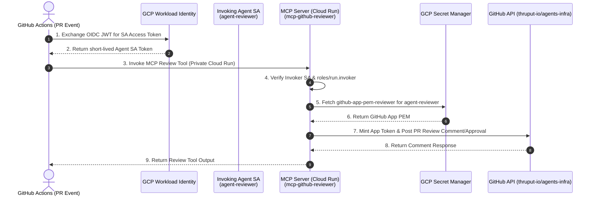

# Implementation Plan: Automated PR Reviewer Flow

This document details the first concrete implementation plan for the **Automated PR Reviewer Flow** on `thruput-io/agents-infra`. 

To adhere strictly to YAGNI and governance principles, this plan defines **EXACTLY** and **ONLY** the minimal parameter contracts and module configurations required to execute the PR reviewer workflow. Zero speculative parameters or future-proofing inputs are included.

---

## 1. Feature Architecture & End-to-End Workflow

The Automated PR Reviewer enables headless, zero-secret PR reviews on `thruput-io/agents-infra`:

---

## 2. Strict Minimal Module Interface Contracts

### 1. Access Group (`modules/access-group`)
- **Purpose**: Creates the Cloud Identity group for reviewer agents and assigns required GCP IAM roles.
- **Minimal Inputs**:
  - `organization_id` (`string`, required): GCP Organization ID.
  - `domain` (`string`, required): `thruput.com`.
  - `prefix` (`string`, required): `"fast-agent"`.
  - `group_definitions` (`map(object({ display_name = string, description = string }))`, required): `{ "reviewer" = { display_name = "FAST Agent Reviewer Group", description = "Group for automated PR reviewer agents" } }`.
  - `group_iam_roles` (`map(list(string))`, required): `{ "reviewer" = ["roles/viewer", "roles/run.invoker"] }`.
- **Minimal Outputs**:
  - `group_email` (`string`): `fast-agent-reviewer@thruput.com`.

---

### 2. Secret Access (`modules/secret-access`)
- **Purpose**: Provisions the Secret Manager shell for the reviewer's GitHub App PEM private key and grants read access to the MCP runtime SA.
- **Minimal Inputs**:
  - `project_id` (`string`, required): GCP Project ID.
  - `secret_id` (`string`, required): `"github-app-pem-reviewer"`.
  - `accessor_service_accounts` (`list(string)`, required): `[mcp_runtime_sa_email]`.
- **Minimal Outputs**:
  - `secret_id` (`string`): Secret Manager resource ID (`projects/*/secrets/github-app-pem-reviewer`).

---

### 3. Agent Identity (`modules/agent-identity`)
- **Purpose**: Provisions the Service Account for `agent-reviewer` and sets up WIF impersonation for `thruput-io/agents-infra`.
- **Minimal Inputs**:
  - `project_id` (`string`, required): GCP Project ID.
  - `agent_call_name` (`string`, required): `"reviewer"`.
  - `workload_identity_pool` (`string`, required): WIF pool resource string.
  - `github_repository` (`string`, required): `"thruput-io/agents-infra"`.
  - `group_membership` (`string`, required): `"fast-agent-reviewer@thruput.com"`.
- **Minimal Outputs**:
  - `service_account_email` (`string`): `agent-reviewer@<project>.iam.gserviceaccount.com`.

---

### 4. Agent GitHub App (`modules/agent-github-app`)
- **Purpose**: Installs the pre-registered `agent-reviewer` GitHub App onto `thruput-io/agents-infra`.
- **Minimal Inputs**:
  - `github_organization` (`string`, required): `"thruput-io"`.
  - `github_repository` (`string`, required): `"agents-infra"`.
  - `pem_secret_id` (`string`, required): `"github-app-pem-reviewer"`.
- **Minimal Outputs**:
  - `installation_id` (`string`): GitHub App Installation ID on `thruput-io/agents-infra`.

---

### 5. MCP Server Runtime (`modules/mcp-server`)
- **Purpose**: Deploys the Cloud Run service hosting the PR review tool runtime.
- **Minimal Inputs**:
  - `project_id` (`string`, required): GCP Project ID.
  - `region` (`string`, required): `"europe-west1"`.
  - `server_name` (`string`, required): `"mcp-github-reviewer"`.
  - `container_image` (`string`, required): Container image URL in Artifact Registry.
  - `mcp_service_account_email` (`string`, required): Dedicated MCP runtime SA.
  - `invoker_service_account_email` (`string`, required): `agent-reviewer@<project>.iam.gserviceaccount.com`.
- **Minimal Outputs**:
  - `service_url` (`string`): Private HTTPS endpoint URL of the MCP server.

---

## 3. Implementation Task Breakdown & Execution Plan

### Phase 1: Module Scaffolding & Directory Setup
- [ ] Task 1.1: Initialize `modules/access-group` with `main.tf`, `variables.tf`, `outputs.tf`.
- [ ] Task 1.2: Initialize `modules/secret-access` with `main.tf`, `variables.tf`, `outputs.tf`.
- [ ] Task 1.3: Initialize `modules/agent-identity` with `main.tf`, `variables.tf`, `outputs.tf`.
- [ ] Task 1.4: Initialize `modules/agent-github-app` with `main.tf`, `variables.tf`, `outputs.tf`.
- [ ] Task 1.5: Initialize `modules/mcp-server` with `main.tf`, `variables.tf`, `outputs.tf`.

### Phase 2: First-Party Test Harness & Integration Validation
- [ ] Task 2.1: Create end-to-end integration test harness under `tests/integration/pr-reviewer/` wiring the 5 submodules together.
- [ ] Task 2.2: Validate `terraform fmt`, `terraform validate`, and `tflint` across all created submodules.
- [ ] Task 2.3: Execute dry-run `terraform plan` against test environment to verify zero speculative inputs or state leaks.

---

## 4. Evidence & Verification Requirements

Every task completed under this plan requires working proof:
1. **Lint & Validation Proof**: Output logs of `terraform fmt -check`, `terraform validate`, and `tflint` for every created module directory.
2. **Contract Strictness Proof**: Verification that zero default values or speculative inputs exist in `variables.tf`.
3. **Execution Plan Output**: Redacted `terraform plan` output demonstrating clean resource creation.
